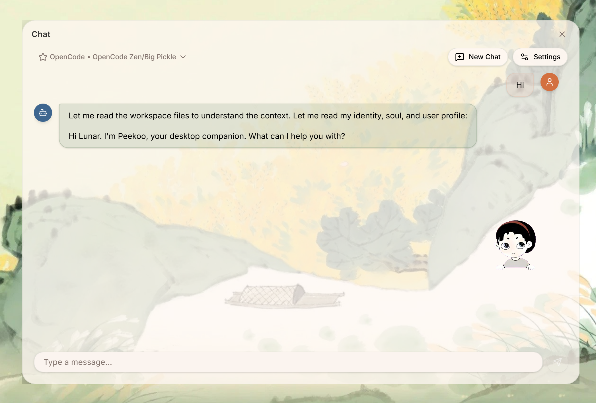
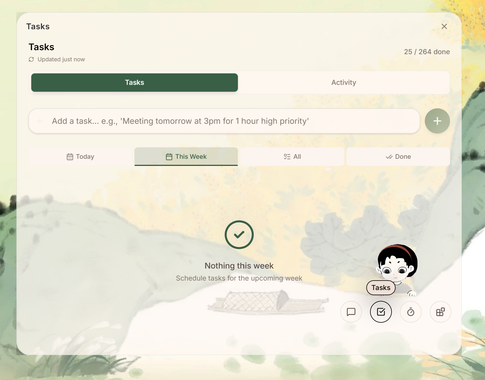
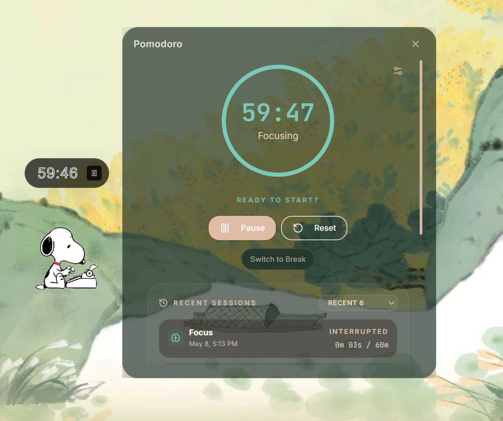
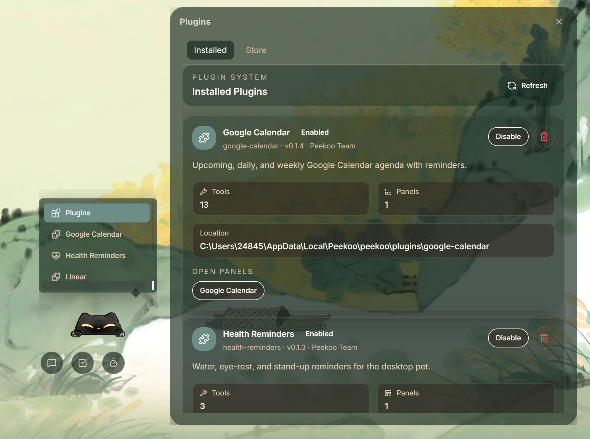

<p align="right">
  <a href="./README.zh.md">中文</a> | English
</p>

<div align="center">

# Peekoo AI

**An infinitely extensible, fully customizable desktop companion**


[](https://youtu.be/TCFbKJELtig)

[](https://github.com/feed-mob/peekoo-ai/releases)
[](LICENSE)
[](#installation)

*Smart extensions, warm intentions.*

</div>

---

## Why Peekoo?

This project started from a question: **how can AI integrate into work and study in a gentler, less intrusive way?**

In a world full of AI tools, we wanted to explore a new possibility — combining the core **companionship** of a desktop pet with the **extensibility** of AI, getting the best of both.

Peekoo's core is companionship. Most of the time it just sits quietly in the corner of your screen, peeking at you, occasionally dozing off — doing exactly what a desktop pet does. What makes it different is that when you need it, it's ready to help.

Two design principles guide everything:

- **Separate "core companionship" from "customization needs"** — keep the core lightweight, extend through plugins on demand, avoid feature bloat
- **Make the agent's work visible and personal** — give a warm, reactive face to what would otherwise be a cold tool

---

## Features

### ★ AI Chat

Start a conversation anytime. Connect CLI tools like OpenCode with one click — easy to configure.

Streaming responses, supports OpenCode, Claude, and other providers. Switch models at runtime without restarting. Toggle between the full Chat panel and the Mini Chat sidebar. All built-in features and plugins are accessible directly through chat.

Supports loading workspace context files (`AGENTS.md`, `SOUL.md`, `MEMORY.md`) to give the agent project-specific knowledge.



### ★ Task Management

Describe tasks in natural language — Peekoo parses time, priority, and details automatically. Built-in task breakdown support. Integrates with external tools (Linear supported today). Task data is shared across the UI, agent, and plugins.

Tasks can also be delegated directly to Peekoo AI — hand a task off and the agent will attempt to complete it automatically via ACP scheduling.



### ★ Pomodoro Timer

Focus sessions with start, pause, resume, and session history. Timer state is woven into the sprite's visual expressions.

After each session, jot down a quick memo — record what you got done, link it to a task, and let every focus session leave a trace. A daily badge wall tracks your rhythm.



### ★ Custom Sprite

Upload your own image to create a personalized desktop character. The settings page includes a built-in image prompt to help you generate one, or draw your own and upload it in the required format. After uploading, Peekoo AI can automatically generate the animation manifest for you — preview, validate, and save in one flow. Built-in sprites (Mimi, Snoopy) included out of the box.


### ★ Skills & MCP

Upload skill files to extend agent capabilities on demand. Bundled skill templates auto-sync to your workspace on every update. MCP configuration support coming soon.

### ★ Multilingual UI

Supports English, 简体中文, 繁體中文, 日本語, Español, and Français. Switch anytime in Settings.

### ★ Auto-Update

System tray → About Peekoo → Check for Updates. Install and restart with one click — no manual downloads.

---

## Plugin Ecosystem

Peekoo's design philosophy: **everything can be a plugin**.

Built on an MCP (Model Context Protocol) architecture, Peekoo reaches outward through an ever-growing set of extensions. Install what you need, skip what you don't.

| Plugin | What it does |
|--------|-------------|
| Health Reminders | Reminds you to drink water, rest your eyes, and stand up during work sessions |
| OpenClaw Sessions | Open and manage OpenClaw browser sessions directly from Peekoo |
| Claude Code Companion | Peekoo's expressions sync with your Claude Code agent's every thought and output |
| OpenCode Companion | Peekoo's expressions sync with your OpenCode agent's every thought and output |
| Mijia Smart Home | Control Mijia smart home devices through chat |
| Google Calendar | Import your schedule and join Google Meet calls directly from chat |
| Linear | Import your existing Todolist and sync with Peekoo tasks |

We're building Peekoo's neural network one plugin at a time. The possibilities are open-ended.



### ACP Runtime Architecture

Peekoo uses ACP (Agent Client Protocol) as the communication layer for agent task execution. The `AgentScheduler` spawns `peekoo-agent-acp` as a subprocess over stdio, passes task context and MCP tool configuration through the ACP protocol, and tears down the process when the task completes. This keeps the agent runtime fully decoupled from the main application process.

Agent runtimes are discovered and installed via the ACP Registry — OpenCode, Kimi, Qwen, Hermes, and more are listed in the registry and installable with one click, no manual environment setup required.

**Roadmap:** We plan to evolve the ACP + MCP toolchain into the primary agent runtime, and expose Peekoo's built-in and plugin tools as a unified MCP service for external agent frameworks to call directly.

---

## Installation

Download the latest release from [GitHub Releases](https://github.com/feed-mob/peekoo-ai/releases). Available for Windows, macOS, and Linux.

### Windows
Run the `x64-setup.exe` installer.

### macOS
Download the `.dmg`, move `Peekoo.app` to `/Applications`, then remove the quarantine flag:
```bash
xattr -cr /Applications/Peekoo.app
```
→ [Detailed macOS guide](docs/en/installation/macos.md)

### Linux (Arch)
```bash
yay -S peekoo-bin
```
→ [AUR package](https://aur.archlinux.org/packages/peekoo-bin)

---

## Quick Start (Developers)

```bash
just setup   # Install all dependencies
just dev     # Run in development mode
```

→ [Full quick-start guide](docs/en/quick-start.md)

---

## Tech Stack

Built on Tauri v2 + Rust — lightweight, memory-friendly. All task data and plugin config stored in a local SQLite database. All credentials and API keys protected by the OS keychain.

| Layer | Technology |
|-------|-----------|
| Desktop Shell | Tauri v2 |
| Frontend | React 18 + TypeScript 5 + Vite 5 |
| Styling | Tailwind CSS v4 |
| Backend | Rust (edition 2024, MSRV 1.85) |
| Agent Runtime | pi_agent_rust |
| Persistence | SQLite (embedded migrations) |
| Secrets | OS keychain with filesystem fallback |

---

## Contributing

Contributions are welcome. See [docs/en/contributing.md](docs/en/contributing.md) to get started.

For plugin development, see [docs/en/develop/plugins.md](docs/en/develop/plugins.md) and the [`plugins/openclaw-sessions/`](plugins/openclaw-sessions) example.

---

## License

MIT
