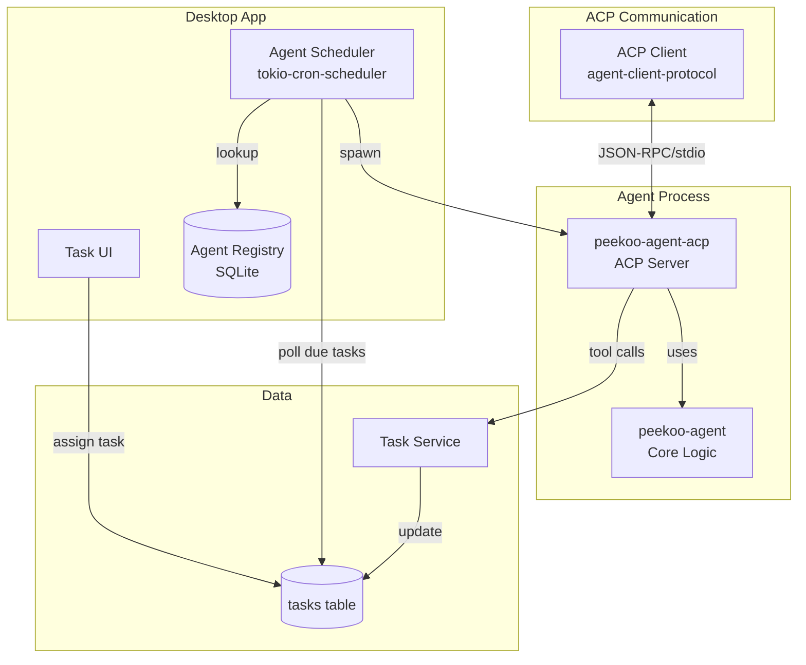

# Task Assignment to AI Agents - Design Document

**Date:** 2026-03-23  
**Status:** Approved for Implementation  
**Related:** Task system, Agent architecture

---

## Overview

This design enables tasks to be assigned to AI agents. When a task is assigned to an agent with a `start_at` time, the agent will automatically work on the task when the time arrives. The agent decides how to handle the task based on its complexity—automatically completing it if straightforward, asking clarifying questions if unclear, or creating a plan for complex tasks.

**Key Decisions:**
- Use **ACP (Agent Communication Protocol)** for standardized agent communication
- Implement peekoo-agent as an **ACP server** in a new crate
- Use **tokio-cron-scheduler** for task scheduling
- Support agent registry with capabilities for future multi-agent support

---

## Architecture

### Component Diagram



### Components

#### 1. `peekoo-agent-acp` (New Crate)

A new binary crate that implements the ACP Agent protocol.

**Responsibilities:**
- Implements ACP `Agent` trait from `agent-client-protocol` crate
- Wraps `peekoo-agent` core logic in ACP protocol
- Handles JSON-RPC communication over stdio
- Registers native task tools (task_comment, task_update, etc.)
- Processes task execution prompts

**Dependencies:**
- `agent-client-protocol` - ACP protocol implementation
- `peekoo-agent` - Core agent functionality
- `peekoo-productivity-domain` - Task domain types

**Binary Target:**
- `peekoo-agent-acp` - Spawned as subprocess by scheduler

#### 2. `peekoo-agent` (Existing)

Core agent logic remains unchanged. Used as a library by `peekoo-agent-acp`.

#### 3. Agent Scheduler (`peekoo-agent-app`)

A new service in the agent app that manages task scheduling and agent invocation.

**Responsibilities:**
- Runs `tokio-cron-scheduler` job every 30 seconds
- Polls database for tasks ready for agent execution
- Claims tasks (prevents duplicate execution)
- Looks up agent configuration in registry
- Spawns ACP agent subprocess
- Manages ACP client lifecycle (initialize → session → prompt)
- Handles agent responses and tool calls
- Retries failed tasks with exponential backoff

#### 4. Agent Registry

SQLite table storing available agents and their configurations.

**Schema:**
```sql
CREATE TABLE agent_registry (
    id TEXT PRIMARY KEY,           -- "peekoo-agent"
    name TEXT NOT NULL,            -- "Peekoo Agent"
    command TEXT NOT NULL,         -- Path to binary or spawn command
    capabilities_json TEXT,         -- ["task_planning", "task_execution", ...]
    config_json TEXT,              -- Additional configuration
    is_active BOOLEAN DEFAULT 1,
    created_at TEXT NOT NULL
);
```

**Default Entry:**
On app startup, ensure the registry contains:
```json
{
  "id": "peekoo-agent",
  "name": "Peekoo Agent",
  "command": "peekoo-agent-acp",
  "capabilities_json": "[\"task_planning\", \"task_execution\", \"question_asking\"]",
  "config_json": "{}"
}
```

#### 5. Task Service Extensions

Extensions to the existing task service to support agent work tracking.

**New Task Fields:**
- `agent_work_status` - pending | claimed | executing | completed | failed
- `agent_work_session_id` - ACP session ID for correlation
- `agent_work_attempt_count` - Number of execution attempts
- `agent_work_started_at` - When agent started working
- `agent_work_completed_at` - When agent finished

---

## Data Model Changes

### Tasks Table Migration

```sql
-- Migration: 0009_agent_task_assignment.sql

-- Update existing assignee values
UPDATE tasks SET assignee = 'peekoo-agent' WHERE assignee = 'agent';

-- Add agent work tracking columns
ALTER TABLE tasks ADD COLUMN agent_work_status TEXT;
ALTER TABLE tasks ADD COLUMN agent_work_session_id TEXT;
ALTER TABLE tasks ADD COLUMN agent_work_attempt_count INTEGER DEFAULT 0;
ALTER TABLE tasks ADD COLUMN agent_work_started_at TEXT;
ALTER TABLE tasks ADD COLUMN agent_work_completed_at TEXT;

-- Index for scheduler queries
CREATE INDEX idx_tasks_agent_execution 
ON tasks(assignee, scheduled_start_at, status, agent_work_status) 
WHERE assignee != 'user';
```

### New Agent Registry Table

```sql
-- Migration: 0010_agent_registry.sql

CREATE TABLE agent_registry (
    id TEXT PRIMARY KEY,
    name TEXT NOT NULL,
    command TEXT NOT NULL,
    capabilities_json TEXT NOT NULL DEFAULT '[]',
    config_json TEXT NOT NULL DEFAULT '{}',
    is_active BOOLEAN NOT NULL DEFAULT 1,
    created_at TEXT NOT NULL
);

-- Insert default peekoo-agent entry
INSERT INTO agent_registry (id, name, command, capabilities_json, created_at)
VALUES (
    'peekoo-agent',
    'Peekoo Agent',
    'peekoo-agent-acp',
    '["task_planning", "task_execution", "question_asking"]',
    datetime('now')
);
```

---

## Implementation Phases

### Phase 1: Core Infrastructure
1. Create `peekoo-agent-acp` crate with basic ACP server
2. Implement ACP Agent trait
3. Add agent registry table and default entry
4. Add agent work tracking columns to tasks table

### Phase 2: Task Scheduler
1. Implement AgentScheduler service
2. Integrate tokio-cron-scheduler
3. Implement task claiming logic
4. Add ACP client integration

### Phase 3: Agent Execution
1. Implement task execution prompt
2. Wire up task tools in peekoo-agent-acp
3. Implement agent decision logic (auto-complete vs plan vs questions)
4. Add task status updates via tool calls

### Phase 4: Recovery & Polish
1. Implement startup recovery for stalled tasks
2. Add retry logic with backoff
3. Frontend: Update assignee selector to use agent registry
4. Frontend: Add visual indicators for agent-assigned tasks
5. Testing and error handling improvements

---

## Dependencies

### New Crates
- `agent-client-protocol` - ACP protocol implementation
- `tokio-cron-scheduler` - Task scheduling

### Modified Crates
- `peekoo-agent-app` - Add AgentScheduler, ACP client
- `peekoo-productivity-domain` - Add TaskService methods, new fields
- `persistence-sqlite` - New migrations
- `apps/desktop-ui` - Frontend changes for agent selection
