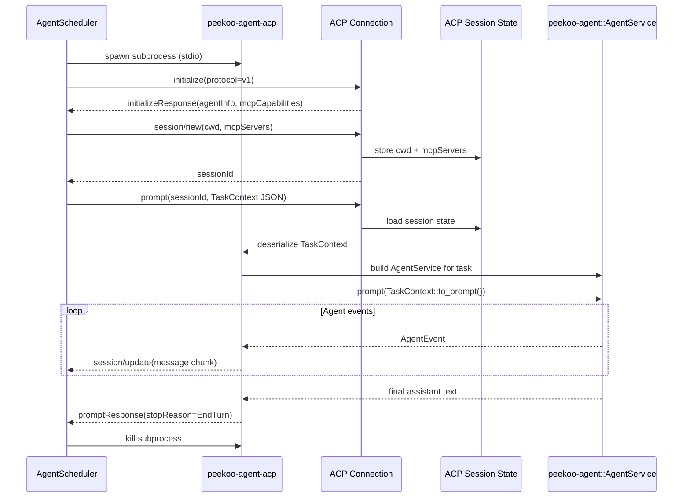

# ACP Task Execution Architecture

This diagram shows how Peekoo uses ACP (Agent Client Protocol) to launch `peekoo-agent-acp` as a subprocess and drive scheduled task execution.

**Related Code:**
- Scheduler: `crates/peekoo-agent-app/src/agent_scheduler.rs`
- ACP Agent: `crates/peekoo-agent-acp/src/agent.rs`
- Task Context: `crates/peekoo-agent-acp/src/context.rs`
- Agent Runtime: `crates/peekoo-agent/src/service.rs`

## Notes

- ACP is the transport boundary between the scheduler and the actual agent runtime.
- `session/new` carries MCP server configuration, so task tools are attached in an ACP-native way.
- The scheduler no longer fabricates task comments; it only orchestrates execution and listens for ACP updates.
- Each task run can reuse a task-scoped persistent agent session when one exists.
