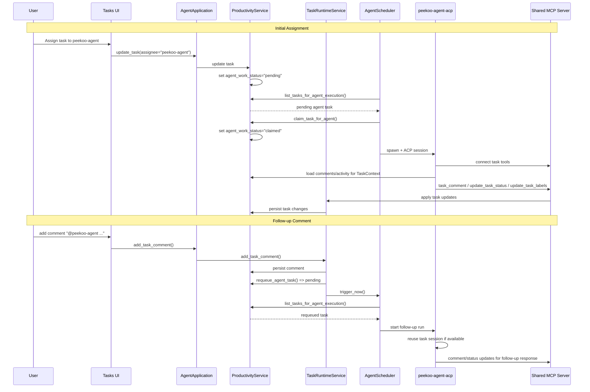

# Agent Task Assignment Flow

This diagram shows how assigning a task to `peekoo-agent` causes the scheduler to pick it up and how later `@peekoo-agent` comments trigger follow-up work.

**Related Code:**
- Task Assignment and State: `crates/peekoo-agent-app/src/productivity.rs`
- Follow-up Runtime Logic: `crates/peekoo-agent-app/src/task_runtime_service.rs`
- Scheduler: `crates/peekoo-agent-app/src/agent_scheduler.rs`
- ACP Agent: `crates/peekoo-agent-acp/src/agent.rs`

## Notes

- Agent-assigned tasks become runnable by setting internal `agent_work_status` to `pending`.
- The scheduler picks tasks by internal agent-work state, not only by visible task status like `todo` or `done`.
- Follow-up comments with `@peekoo-agent` immediately requeue the task and trigger the scheduler without waiting for the next poll tick.
- Follow-up runs now receive comment-only context in chronological order, with the latest comment explicitly highlighted.
