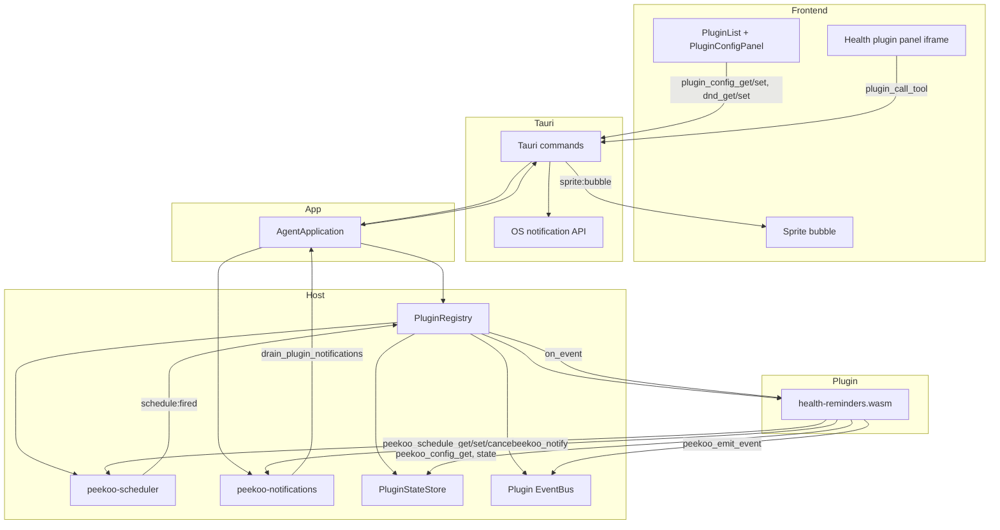

# Health Reminder Runtime Architecture

This diagram documents the post-refactor reminder flow after moving scheduling and notification delivery out of the old event-bus-driven timer path.

## Notes

- `schedule:fired` replaces the old `timer:tick` model for health reminders.
- DND is enforced inside `peekoo-notifications`, not inside the scheduler.
- Pomodoro lifecycle commands dispatch plugin events so the plugin can pause and restore its schedules.
- Manifest-declared config fields are rendered by the desktop UI and stored through the host config API.
