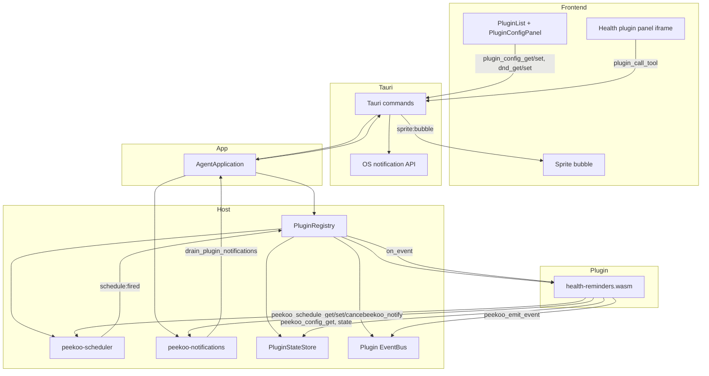
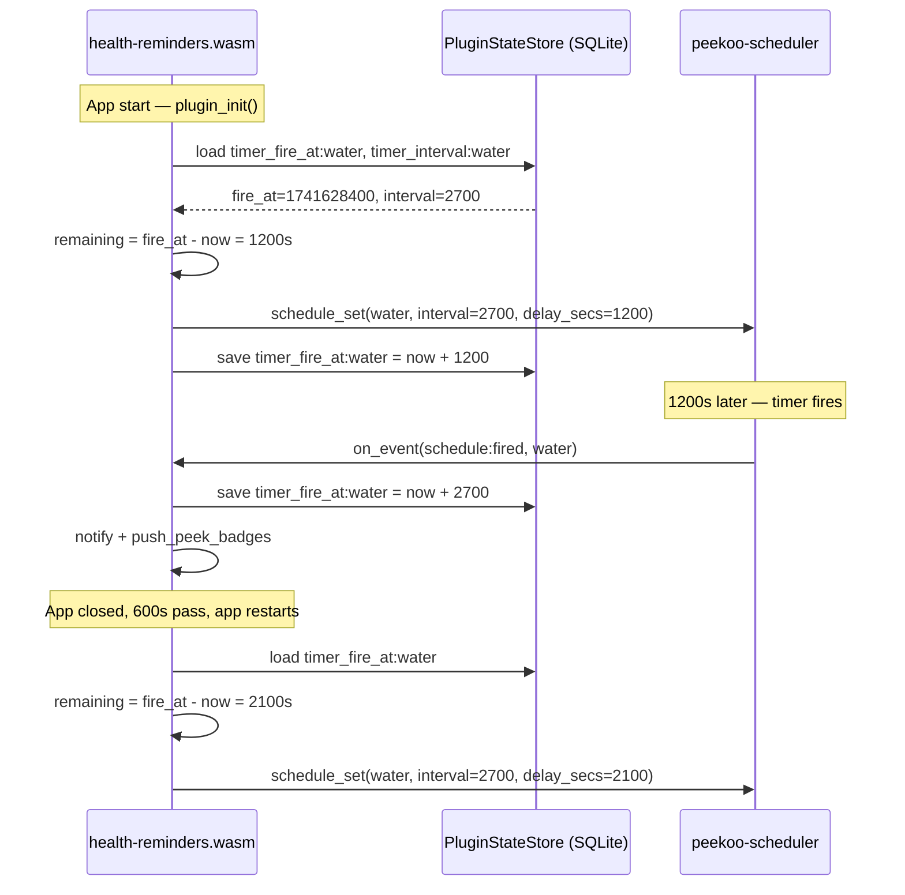

# Health Reminder Runtime Architecture

This diagram documents the post-refactor reminder flow after moving scheduling and notification delivery out of the old event-bus-driven timer path.

## Countdown Persistence Flow

Timers survive app restarts via wall-clock timestamps stored in SQLite.

### Persisted State Keys (per reminder type)

| Key | Type | Description |
|-----|------|-------------|
| `timer_fire_at:<type>` | `u64` (epoch secs) | Wall-clock time when the timer will next fire |
| `timer_interval:<type>` | `u64` (seconds) | Interval used when the timer was set (for stale detection) |

### Edge Cases

| Scenario | `delay_secs` value |
|----------|--------------------|
| No stored timestamp (first run) | `None` (full interval) |
| Interval changed while app closed | `None` (fresh start) |
| Timer overdue, `fire_if_overdue: true` | `Some(0)` (immediate) |
| Timer overdue, `fire_if_overdue: false` | `Some(interval - (overdue % interval))` (skip to next cycle) |
| Timer still pending | `Some(fire_at - now)` |

Health reminders use `fire_if_overdue: false` -- a 45-min timer overdue by 2 min resumes with 43 min remaining, not 0 or 45.

## Notes

- `schedule:fired` replaces the old `timer:tick` model for health reminders.
- DND is enforced inside `peekoo-notifications`, not inside the scheduler.
- Pomodoro lifecycle commands dispatch plugin events so the plugin can pause and restore its schedules.
- Manifest-declared config fields are rendered by the desktop UI and stored through the host config API.
- `Scheduler::set()` accepts `delay_secs: Option<u64>` to override the first fire delay while keeping the full interval for subsequent repeats.
