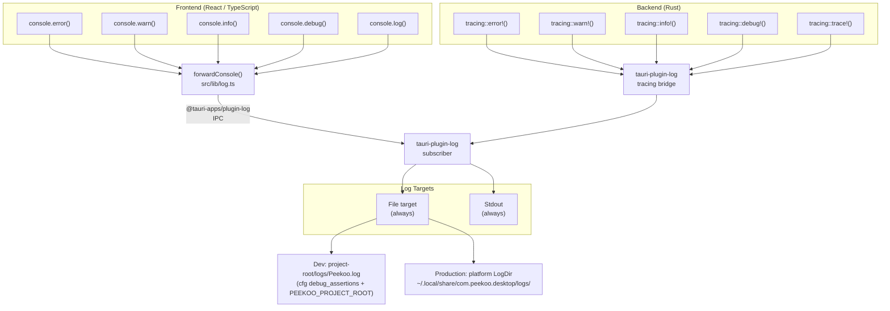

# Logging Architecture

Unified log pipeline routing both Rust backend and TypeScript frontend messages to a single persistent log file.



## Configuration

| Setting | Value |
|---------|-------|
| Default level — production | `error` |
| Default level — dev (`just dev`) | `trace` |
| Runtime override | `RUST_LOG` env var |
| Max file size | 5 MB |
| Rotation | Keep last 5 files |

## Level Control

```
RUST_LOG=trace just dev          # everything
RUST_LOG=debug just dev          # debug and above
RUST_LOG=peekoo_plugin_host=trace just dev  # per-crate filter
```

## Notes

- `forwardConsole()` preserves original browser console output and sends a copy to the Rust backend
- Format strings (`%s`, `%d`, `%o`, etc.) are expanded before sending so log entries are human-readable
- The `tracing` feature on `tauri-plugin-log` bridges all existing `tracing::*` calls in `peekoo-plugin-host` and `peekoo-agent-app` automatically — no changes needed in those crates
- Dev vs production file path is determined at runtime via `cfg!(debug_assertions)`, not a feature flag
