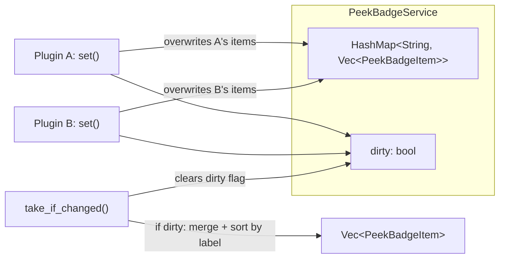

# Peek Badge Architecture

Data flow for the generic peek badge system that displays rotating status items above the sprite.

```mermaid
graph TD
    subgraph WASM Plugin
        PluginInit["plugin_init()"]
        OnEvent["on_event()"]
        ToolCall["tool_health_configure / dismiss"]
        PushBadges["push_peek_badges()"]
    end

    subgraph Host Runtime
        HostFn["peekoo_set_peek_badge"]
        BadgeService["PeekBadgeService"]
    end

    subgraph Application Layer
        AgentApp["AgentApplication"]
        TakeIfChanged["take_peek_badges_if_changed()"]
    end

    subgraph Tauri Transport
        FlushLoop["Background loop (250ms)"]
        FlushBadges["flush_peek_badges()"]
        EmitEvent["app.emit_to('main', 'sprite:peek-badges', badges)"]
    end

    subgraph Frontend
        UsePeekBadge["usePeekBadge hook"]
        CountdownTick["1s countdown tick"]
        Rotation["5s item rotation"]
        Badge["SpritePeekBadge component"]
    end

    PluginInit --> PushBadges
    OnEvent --> PushBadges
    ToolCall --> PushBadges
    PushBadges -->|JSON array| HostFn
    HostFn -->|set(plugin_key, items)| BadgeService

    FlushLoop --> TakeIfChanged
    TakeIfChanged -->|Some(merged_items)| FlushBadges
    FlushBadges --> EmitEvent

    EmitEvent -->|Tauri event| UsePeekBadge
    UsePeekBadge --> CountdownTick
    UsePeekBadge --> Rotation
    CountdownTick --> Badge
    Rotation --> Badge
```

## Badge Item Shape

```json
{
  "label": "Eye Rest",
  "value": "~4 min",
  "icon": "eye",
  "countdown_secs": 240
}
```

- `label`: Display name (e.g., "Water", "Eye Rest", "Standup")
- `value`: Human-readable countdown text, re-formatted locally by the frontend
- `icon`: Optional Lucide icon name for visual identification
- `countdown_secs`: Optional raw seconds for frontend-side local countdown ticking

## PeekBadgeService Internals



Each plugin owns its own badge slot. `set()` replaces all items for that plugin. `take_if_changed()` merges all plugins' items into a flat sorted list and clears the dirty flag.

## Visibility Rules

| State | Badge visible? |
|-------|---------------|
| Idle, items exist | Yes (rotating single pill) |
| Badge clicked | Expanded (all items stacked) |
| Action menu open | Hidden |
| Notification bubble showing | Hidden (badge collapses) |
| No active status items | Hidden |

## Window Sizing

The sprite window grows upward to accommodate the badge. Badge height is computed by `peekBadgeExtraHeight()`:
- **Collapsed**: `PEEK_BADGE_HEIGHT (36px) + PEEK_BADGE_PADDING (8px)` = 44px
- **Expanded**: `itemCount * PEEK_BADGE_ROW_HEIGHT (28px) + PEEK_BADGE_PADDING * 2` 
- **Hidden**: 0px (when bubble or menu is active)

## Notes

- The badge system is generic: any WASM plugin can call `peekoo_set_peek_badge` to contribute items
- The health-reminders plugin is the first consumer, pushing badges on init, schedule:fired, pomodoro events, and tool calls
- Frontend countdown ticking runs independently at 1s intervals, using the snapshot timestamp to compute elapsed time
- The background flush loop only emits `sprite:peek-badges` when badges have actually changed (dirty flag)
