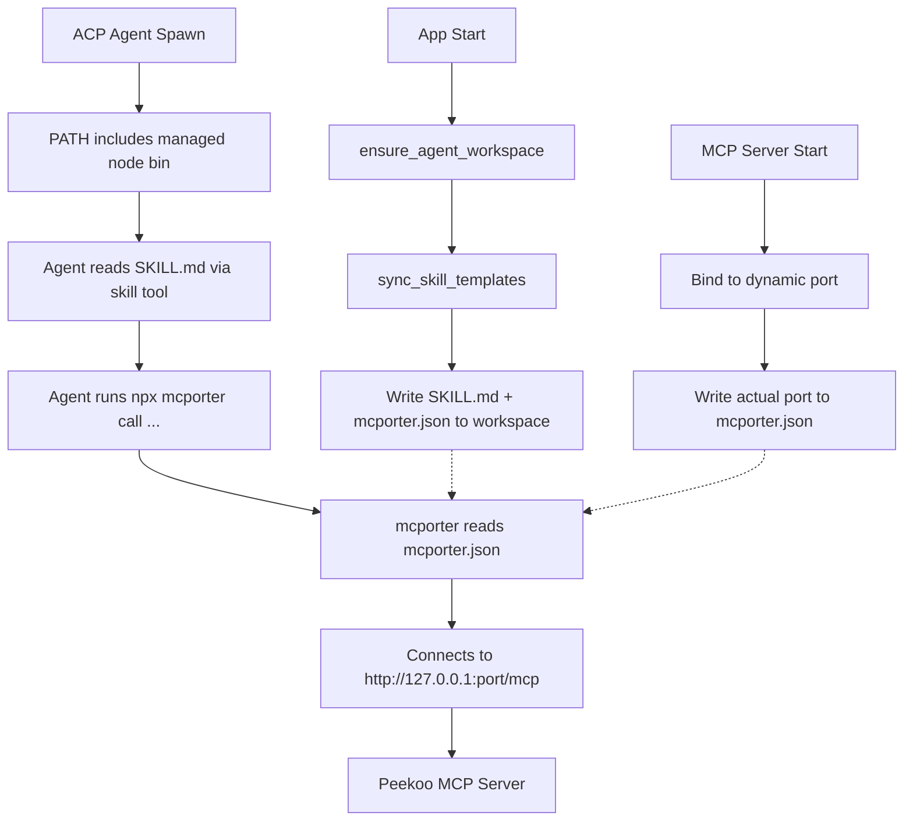
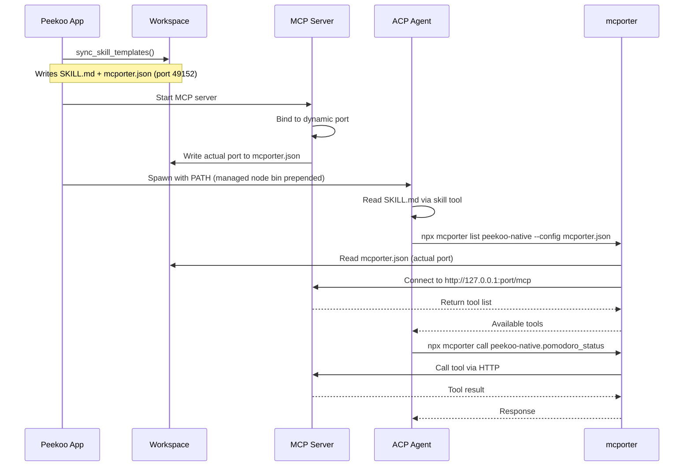

# peekoo-agent-skill / mcporter Architecture

## Overview
ACP agents that don't support MCP natively can access peekoo productivity tools via the mcporter CLI. The skill is auto-synced to the workspace, and the mcporter config is updated at runtime with the actual MCP server port.

## Architecture



## Data Flow



## Key Components

| Component | Location | Purpose |
|-----------|----------|---------|
| Skill Template | `templates/persona/.agents/skills/peekoo-agent-skill/` | Bundled skill files |
| build.rs | `crates/peekoo-agent-app/build.rs` | Auto-discovers skill files |
| sync_skill_templates() | `workspace_bootstrap.rs` | Copies to workspace on app start |
| write_mcporter_config() | `mcp_server.rs` | Updates port in mcporter.json |
| build_launch_env() | `runtime_adapters/mod.rs` | Prepends managed node bin to PATH |

## Port Resolution

The MCP server binds to a dynamic port (scans 49152-65535). The mcporter.json template starts with port 49152, but is overwritten at runtime with the actual bound port. This ensures mcporter always connects to the correct endpoint.

## PATH Resolution

```
Agent PATH = <managed_node_bin>:<system_PATH>
```

The managed Node.js bin directory is prepended to ensure `npx` is always available, even if the user doesn't have system Node.js installed. Resolution order:
1. Managed runtime: `~/.peekoo/data/resources/node/v20.18.0/bin/`
2. System PATH: inherited from parent process
