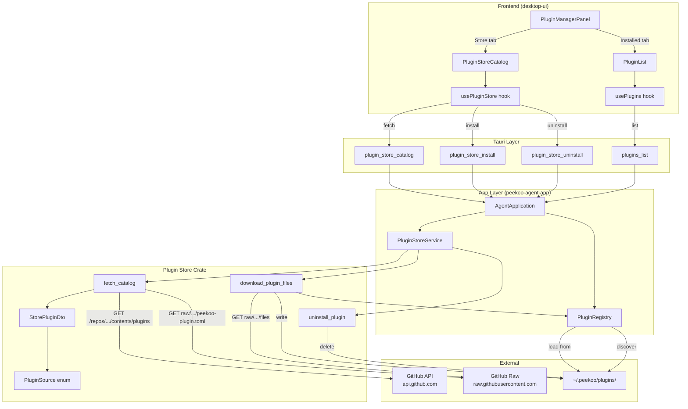

# Plugin Store Architecture

Data flow for plugin discovery, installation, and uninstallation from the GitHub-based plugin store.

## Data Flow Summary

### Fetch Catalog
1. Frontend calls `plugin_store_catalog` on Store tab open
2. `AgentApplication.store_catalog()` → `PluginStoreService.fetch_catalog()`
3. Service fetches plugin directory list from GitHub API
4. For each plugin directory, fetches `peekoo-plugin.toml` from raw URL
5. Cross-references with local `PluginRegistry.discover()` to set `installed` and `source`
6. Returns `Vec<StorePluginDto>` to frontend

### Install Plugin
1. Frontend calls `plugin_store_install` with `pluginKey`
2. `AgentApplication.store_install()` → `PluginStoreService.install_plugin()`
3. Service creates `~/.peekoo/plugins/<key>/` directory
4. Recursively downloads all files from GitHub raw URLs
5. Calls `PluginRegistry.install_plugin()` to load the WASM
6. Returns updated `StorePluginDto` with `installed: true, source: Store`
7. Frontend updates local catalog state and refreshes installed list

### Uninstall Plugin
1. Frontend calls `plugin_store_uninstall` with `pluginKey`
2. `AgentApplication.store_uninstall()` → `PluginStoreService.uninstall_plugin()`
3. Verifies plugin exists in `~/.peekoo/plugins/<key>/`
4. Calls `PluginRegistry.unload_plugin()` to unload WASM
5. Deletes `~/.peekoo/plugins/<key>/` directory
6. Frontend updates local catalog state and refreshes installed list

## Key Design Decisions

- **Separate crate**: `peekoo-plugin-store` is isolated from `peekoo-agent-app` for clean SRP
- **Global-only install**: Only `~/.peekoo/plugins/` is used for user-facing installs; workspace `plugins/` is for development only
- **Optimistic UI**: Frontend updates catalog state locally after install/uninstall without re-fetching
- **Per-plugin loading**: `usePluginStore` tracks installing state per plugin via `Set<string>`
- **Cleanup on failure**: Partial downloads are cleaned up to avoid blocking future installs
- **Recursion limit**: Max 10 directory levels to prevent stack overflow from malicious API responses
