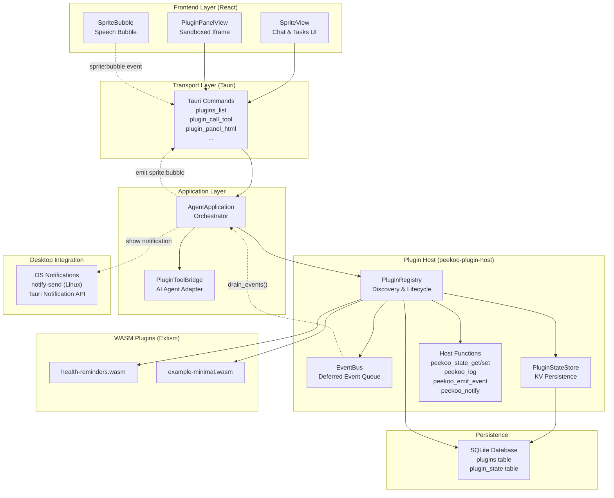
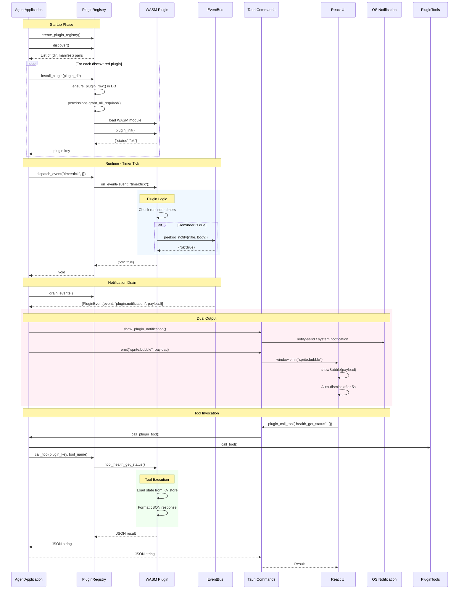
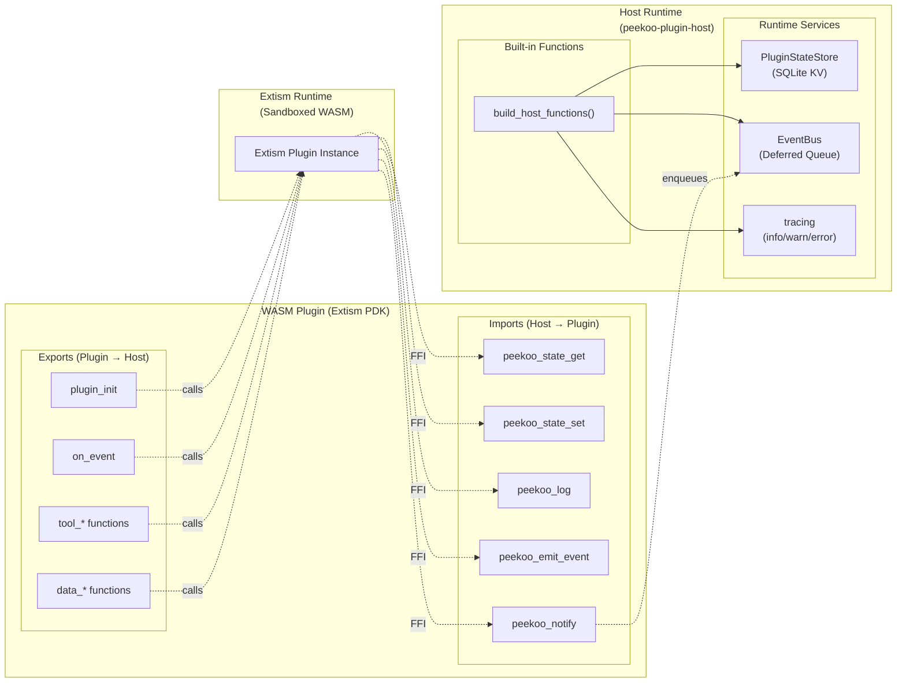
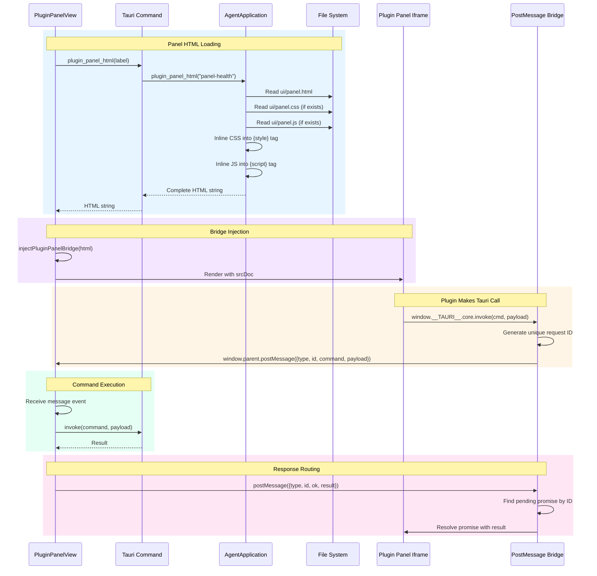

# Peekoo Plugin System Architecture

This document describes the WASM-based plugin system for the Peekoo AI desktop pet application.

**Related Code:**
- Plugin Host: `crates/peekoo-plugin-host/`
- Application Layer: `crates/peekoo-agent-app/src/plugin.rs`
- UI Bridge: `apps/desktop-ui/src/lib/plugin-panel-bridge.ts`
- Sprite Bubble: `apps/desktop-ui/src/components/sprite/SpriteBubble.tsx`
- Example Plugin: `plugins/health-reminders/`

---

## Diagram 1: High-Level Architecture



---

## Diagram 2: Plugin Lifecycle & Event Flow



---

## Diagram 3: Host Function Interface



### Host Function Details

| Function | Input | Purpose |
|----------|-------|---------|
| `peekoo_state_get` | `{"key": "..."}` | Read from plugin's KV store |
| `peekoo_state_set` | `{"key": "...", "value": {...}}` | Write to plugin's KV store |
| `peekoo_log` | `{"level": "info", "message": "..."}` | Log to Peekoo tracing |
| `peekoo_emit_event` | `{"event": "...", "payload": {...}}` | Emit event to EventBus |
| `peekoo_notify` | `{"title": "...", "body": "..."}` | Queue notification for drain |

---

## Diagram 4: UI Panel Loading & Bridge Flow



### Why PostMessage Bridge?

The plugin panel iframe is **sandboxed** (`sandbox="allow-scripts"`) and does **not** have access to:
- `window.__TAURI__` directly
- Tauri APIs

The bridge injects a script that:
1. Intercepts `window.__TAURI__.core.invoke()` calls
2. Uses `postMessage` to communicate with parent React component
3. Parent component executes actual Tauri command
4. Response is sent back via `postMessage` and resolves the original promise

---

## Key Design Decisions

### 1. Why Extism WASM Runtime?
- **Sandboxing**: Plugins run in isolated WASM memory, cannot access host filesystem directly
- **Portability**: Same plugin binary runs on Windows, macOS, Linux
- **Performance**: Near-native execution speed
- **Tooling**: Extism PDK provides clean Rust API for host functions

### 2. Why Deferred EventBus?
Plugins emit events via `peekoo_emit_event` during WASM execution while the registry lock is held. Immediate dispatch would be **re-entrant** (calling back into the same plugin). Events are **enqueued** and **drained** after each plugin call returns.

### 3. Why Iframe Sandboxing + PostMessage?
- **Security**: Plugin-provided HTML could contain malicious scripts
- **Isolation**: Sandboxed iframe cannot access parent window's state or Tauri APIs
- **Bridge Pattern**: Clean interface between untrusted plugin code and trusted host

### 4. Why Dual Notification Output?
- **OS Notification**: Works when app is not focused, persists in system tray
- **Sprite Bubble**: Inline UI feedback when app is visible, more personal/engaging

---

## Integration Points

### Agent Integration
- `PluginToolBridge` collects tool definitions from all loaded plugins
- Tool specs are injected into the agent's system prompt
- Agent can call plugin tools by name; bridge routes to correct plugin

### Event System
Plugins subscribe to events in `peekoo-plugin.toml`:
```toml
[events]
subscribe = ["timer:tick", "pomodoro:finished"]
emit = ["health:reminder-due"]
```

System emits `timer:tick` every 60 seconds via background thread.

### State Persistence
Each plugin has isolated KV store in SQLite:
```sql
plugin_state(plugin_id, state_key, value_json)
```
Plugin can only access its own keys (enforced by SQL queries).

---

## Related Documentation

- [Plugin Manifest Format](crates/peekoo-plugin-host/src/manifest.rs)
- [Host Functions Implementation](crates/peekoo-plugin-host/src/host_functions.rs)
- [Example Plugin](plugins/health-reminders/)
