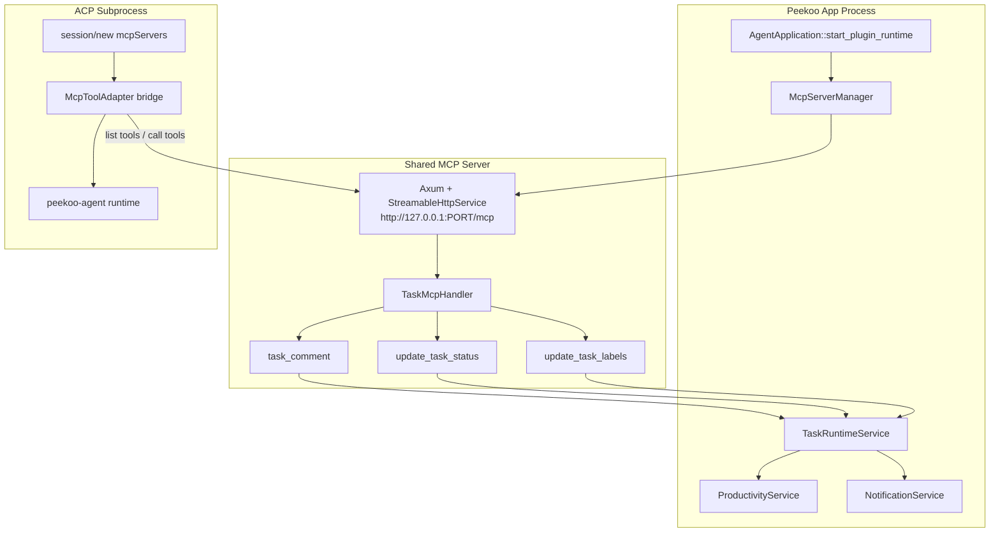

# Task MCP Architecture

This diagram shows how Peekoo's shared MCP server exposes task tools and how ACP bridges those tools into the real agent runtime.

**Related Code:**
- Shared MCP Startup: `crates/peekoo-agent-app/src/mcp_server.rs`
- MCP Server: `crates/peekoo-mcp-server/src/lib.rs`
- MCP Handler: `crates/peekoo-mcp-server/src/handler.rs`
- ACP MCP Bridge: `crates/peekoo-agent-acp/src/mcp_tools.rs`
- Task Runtime Service: `crates/peekoo-agent-app/src/task_runtime_service.rs`

## Notes

- The MCP server is shared across all task executions for the app lifetime.
- The server speaks RMCP streamable HTTP at `/mcp`.
- ACP receives MCP server definitions in `session/new`, connects to them, and re-exposes the MCP tools as native `pi` tools.
- `TaskRuntimeService` adds orchestration behavior on top of persistence, including follow-up mention requeueing and agent notifications.
- Only agent comments and agent status changes produce desktop notifications.
