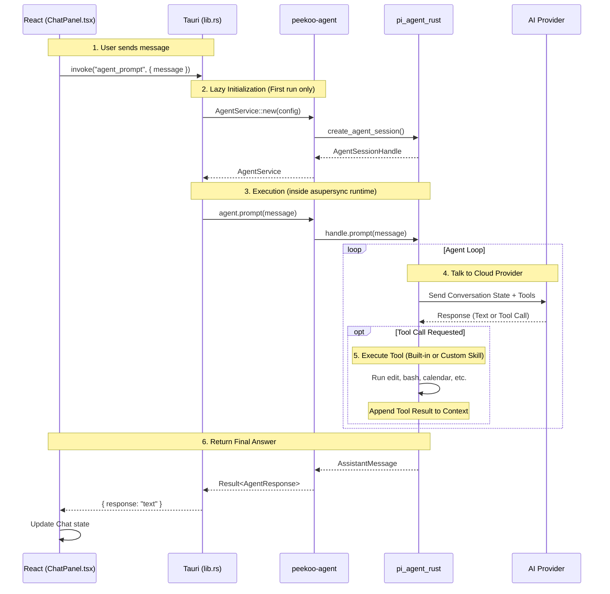

# Peekoo Agent Integration Guide

`peekoo-agent` is the core reasoning engine for Peekoo AI, built as a wrapper around [`pi_agent_rust`](https://github.com/Dicklesworthstone/pi_agent_rust). It provides a simplified API for managing LLM sessions, tools (skills), and switching models on the fly.

## Architecture



---

## 🔐 1. Authentication & Login

Pi supports multiple AI providers. Authentication works seamlessly via Environment Variables or Pi's internal `auth.json`.

### Option A: Environment Variables (Recommended for Development)
Simply set the API key in your shell before launching Peekoo:

```bash
export ANTHROPIC_API_KEY="sk-ant-..."
export OPENAI_API_KEY="sk-proj-..."
export GOOGLE_API_KEY="AIza..."
```

### Option B: Using `auth.json` (Recommended for Production/Users)
You can directly save your credentials to `~/.pi/agent/auth.json`:

```json
{
  "anthropic": { "api_key": "sk-ant-..." },
  "openai": { "api_key": "sk-proj-..." }
}
```

### Option C: OpenAI Codex (ChatGPT OAuth)
If you want to use the free **OpenAI Codex** (`gpt-5.3-codex`) provider via ChatGPT:
1. Install the Pi CLI: `curl -fsSL https://raw.githubusercontent.com/Dicklesworthstone/pi_agent_rust/main/install.sh | bash`
2. Run the login flow: `pi auth login openai-codex`
3. This will open a browser to authenticate and automatically save the OAuth token to `~/.pi/agent/auth.json`.

---

## 🤖 2. Provider & Model Configuration

Pi auto-resolves the default model based on available API keys, but you can configure it explicitly.

### Default Configuration (`~/.pi/agent/settings.json`)
Set a permanent default across all Peekoo sessions:

```json
{
  "default_provider": "anthropic",
  "default_model": "claude-sonnet-4-6"
}
```

### Runtime Configuration (via Tauri / Rust)
You can switch providers and models dynamically during a session. 

**From the frontend (React/Tauri):**
```typescript
import { invoke } from "@tauri-apps/api/core";

// Switch to OpenAI GPT-4o
await invoke("agent_set_model", {
  provider: "openai",
  model: "gpt-4o",
});

// Switch to OpenAI Codex (Free ChatGPT)
await invoke("agent_set_model", {
  provider: "openai-codex",
  model: "gpt-5.3-codex",
});
```

**From the backend (Rust):**
```rust
agent.set_model("openai", "gpt-4o").await?;
```

---

## 🎭 3. System Prompts & Persona Files

### Inline System Prompt
You can define a custom persona, set rules, or provide context by setting a `system_prompt` when initializing the agent.

```rust
use peekoo_agent::config::AgentServiceConfig;

let config = AgentServiceConfig {
    system_prompt: Some("You are Peekoo, a helpful and friendly desktop AI pet. Always be concise.".into()),
    ..Default::default()
};
```

### Startup Instruction Files

For richer agent personalities, you can use a directory of markdown files inspired by [OpenClaw](https://github.com/nichochar/open-claw):

| File | Purpose |
|------|---------|
| `AGENTS.md` | Operating instructions and memory usage guidelines |
| `SOUL.md` | Persona tone and behavioral boundaries |
| `IDENTITY.md` | Agent name, vibe, and emoji |
| `USER.md` | User profile and addressing preferences |
| `memory.md` or `MEMORY.md` | Persistent facts, user preferences, project context |
| `memories/*.md` | Additional topic-specific memory notes |

All files are **optional**. They are composed into the system prompt in this order:

`AGENTS` → `SOUL` → `IDENTITY` → `USER` → `MEMORY` → `system_prompt` → `agent_skills`

This support is additive and backward compatible with existing `IDENTITY` / `SOUL` / memory-only setups.

```rust
use std::path::PathBuf;
use peekoo_agent::config::AgentServiceConfig;

let config = AgentServiceConfig {
    persona_dir: Some(PathBuf::from("./persona")),
    // system_prompt can still be used for additional overrides
    ..Default::default()
};
```

### Convention-based Auto-discovery

By default (`auto_discover: true`), `peekoo-agent` will automatically search for a `.peekoo/` configuration directory to determine the persona and skills.

**The search order is:**
1. Directory path set via the **`PEEKOO_CONFIG_DIR`** environment variable.
2. `.peekoo/` in the current working directory.
3. `~/.peekoo/` in the user's home directory.

**Workspace Isolation:**
Because Peekoo acts as a persistent desktop assistant sprite, its execution workspace is isolated from the directory where the application binary was launched. When Peekoo discovers a valid `.peekoo/` configuration (whether locally or via `PEEKOO_CONFIG_DIR`), it will automatically set its `working_directory` for file-system tools to the `workspace/` subdirectory *inside* that config folder (e.g., `~/.peekoo/workspace/`).

If found, it automatically uses/creates:
- **Startup instructions:** `IDENTITY.md`, `SOUL.md`, `memory.md` (or `MEMORY.md`), `memories/*.md`, `AGENTS.md`, and `USER.md` within the config dir.
- **Skills:** Any markdown files or `SKILL.md` subdirectories inside the `skills/` folder.
- **Tools Execution:** `.peekoo/workspace/` is created as the isolated sandbox.

```rust
use peekoo_agent::config::AgentServiceConfig;

// No need to configure paths if using the `.peekoo/` convention!
// The agent will automatically find its persona and isolate its workspace.
let config = AgentServiceConfig::default(); 
```

Explicitly setting `persona_dir` or `agent_skills` will override auto-discovery for those respective features.

See `examples/persona/` for sample files.
---

## 🛠️ 4. Custom Skills (Tools)

`peekoo-agent` supports adding custom skills via plain text markdown files following the [AgentSkills specification](https://agentskills.io). These are treated as **instructions** and injected into the LLM's system prompt to teach it how to use existing built-in tools (like `bash` or `read`) to accomplish domain-specific tasks.

```rust
use std::path::PathBuf;
use peekoo_agent::config::AgentServiceConfig;

let config = AgentServiceConfig {
    agent_skills: vec![
        PathBuf::from("/path/to/my-agent-skill.md"),
        PathBuf::from("/path/to/directory-of-skills"), // Will search for SKILL.md
    ],
    ..Default::default()
};
```


## 💡 4. Other Important Information

### Built-in Tools
By default, `peekoo-agent` inherits Pi's powerful built-in filesystem tools:
- `read`
- `write`
- `edit`
- `bash`
- `grep`
- `find`
- `ls`

### The Agent Loop
When you call `agent.prompt("message", callback)`, the agent will:
1. Send the message to the LLM.
2. If the LLM requests a tool (like your custom Skill or `bash`), the agent executes it automatically.
3. The result is fed back to the LLM.
4. This loops until the LLM produces a final text response.
5. `max_tool_iterations` (default: 50) protects against infinite tool loops.

### Async Runtime Warning
Pi uses a custom lightweight async runtime (`asupersync`). Because Tauri uses `tokio`, the `AgentService` must be run inside an `asupersync` context. 

If adding new Tauri commands that interact directly with the agent, wrap the logic like this:

```rust
let reactor = asupersync::runtime::reactor::create_reactor()?;
let runtime = asupersync::runtime::RuntimeBuilder::current_thread()
    .with_reactor(reactor)
    .build()?;

let result = runtime.block_on(async move {
    agent.prompt("Hello", |_| {}).await
});
```
